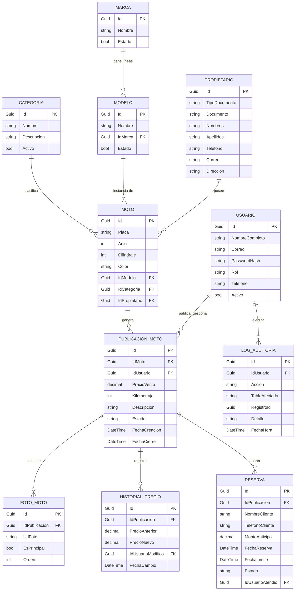

# 🏍️ BAIKUREDO - Diseño y Modelo de Base de Datos

Este documento define la estructura oficial de la base de datos para la plataforma **BAIKUREDO**, basada en las necesidades de negocio del análisis de requisitos ([Fishbone Diagram](file:///home/juanes/Desktop/Programacion-Csharp/Project-Csharp/analisis-requisitos/Fishbone%20Diagram.pdf) e [Impact Mapping](file:///home/juanes/Desktop/Programacion-Csharp/Project-Csharp/analisis-requisitos/Impact%20Mapping.pdf)), y alineada con la arquitectura de [.NET 10 y Entity Framework Core](file:///home/juanes/Desktop/Programacion-Csharp/Project-Csharp/README.md).

---

## 1. Convenciones Técnicas

1. **Llaves Primarias:** Todas las tablas usan `Id` tipo `Guid` (`uniqueidentifier`). Se recomienda `Guid.CreateVersion7()` para ordenamiento temporal y alto rendimiento en índices SQL.
2. **Nombres de Tablas:** Nombres en plural o sustantivos representativos (ej: `Categorias`, `Marcas`, `Modelos`, `Motos`, `Publicaciones`).
3. **Restricciones y Longitudes:** Todo `string` (`nvarchar`) tiene longitud explícita para evitar asignaciones por defecto de `NVARCHAR(MAX)` innecesarias.
4. **Campos de Auditoría:** Las entidades operativas clave cuentan con trazabilidad para saber quién y cuándo creó o modificó cada registro.

---

## 2. Jerarquía de Producto

La cadena de clasificación de una motocicleta en Baikuredo sigue esta jerarquía:

```
Categoría (tipo de moto)  ─┐
                            ├──▶  Moto (vehículo físico con placa)
Marca ──▶ Modelo (línea)  ─┘
```

- Una **Marca** tiene muchos **Modelos** (ej: Yamaha → MT-09, FZ-25, NMAX).
- Un **Modelo** pertenece a exactamente una **Marca**.
- Una **Moto** referencia un **Modelo** (y a través de él, la marca) y una **Categoría**.

---

## 3. Diagrama Entidad-Relación (ERD)



---

## 4. Diccionario de Datos Detallado

### 4.1. `Categorias` (Entidad Base — Cero Dependencias)
Clasificación de motocicletas (Scooter, Deportiva, Enduro, Naked, Touring, etc.).

| Columna | Tipo SQL | C# | Nulo | Descripción |
|---|---|---|---|---|
| `Id` | `uniqueidentifier` | `Guid` | NO | Clave primaria. |
| `Nombre` | `nvarchar(50)` | `string` | NO | Nombre de la categoría (ej. "Scooter"). Único. |
| `Descripcion` | `nvarchar(250)` | `string?` | SÍ | Descripción o características de la categoría. |
| `Activo` | `bit` | `bool` | NO | Para borrado lógico (`true` por defecto). |

### 4.2. `Marcas` (Entidad Base — Cero Dependencias)
Marcas comerciales de las motocicletas (Yamaha, Suzuki, Bajaj, etc.).

| Columna | Tipo SQL | C# | Nulo | Descripción |
|---|---|---|---|---|
| `Id` | `uniqueidentifier` | `Guid` | NO | Clave primaria. |
| `Nombre` | `varchar(50)` | `string` | NO | Nombre de la marca. Único. |
| `Estado` | `bit` | `bool` | NO | Estado de la marca (`true` = activa). |

### 4.3. `Modelos` (Depende de Marcas)
Líneas o referencias comerciales de cada marca (ej: Yamaha MT-09, Bajaj Pulsar NS200).

| Columna | Tipo SQL | C# | Nulo | Descripción |
|---|---|---|---|---|
| `Id` | `uniqueidentifier` | `Guid` | NO | Clave primaria. |
| `Nombre` | `varchar(50)` | `string` | NO | Nombre del modelo/línea (ej. "MT-09", "Duke 200"). |
| `IdMarca` | `uniqueidentifier` | `Guid` | NO | FK hacia `Marcas`. |
| `Estado` | `bit` | `bool` | NO | Estado del modelo (`true` = activo). |

### 4.4. `Propietarios`
Persona natural o jurídica que entrega la moto para venta/consignación. No requiere cuenta web.

| Columna | Tipo SQL | C# | Nulo | Descripción |
|---|---|---|---|---|
| `Id` | `uniqueidentifier` | `Guid` | NO | Clave primaria. |
| `TipoDocumento` | `nvarchar(10)` | `string` | NO | CC, CE, NIT, Pasaporte. |
| `Documento` | `nvarchar(20)` | `string` | NO | Número de identificación. |
| `Nombres` | `nvarchar(60)` | `string` | NO | Nombres del propietario. |
| `Apellidos` | `nvarchar(60)` | `string` | NO | Apellidos del propietario. |
| `Telefono` | `nvarchar(20)` | `string` | NO | Teléfono de contacto. |
| `Correo` | `nvarchar(100)` | `string?` | SÍ | Correo electrónico de contacto. |
| `Direccion` | `nvarchar(150)` | `string?` | SÍ | Dirección de residencia. |

### 4.5. `Motos` (Depende de Modelos, Categorias, Propietarios)
Ficha técnica del vehículo. Permanece invariable aunque cambie de dueño con el paso de los años.

| Columna | Tipo SQL | C# | Nulo | Descripción |
|---|---|---|---|---|
| `Id` | `uniqueidentifier` | `Guid` | NO | Clave primaria. |
| `Placa` | `nvarchar(10)` | `string` | NO | Placa del vehículo (Única). |
| `Anio` | `int` | `int` | NO | Año del modelo (ej: 2023). |
| `Cilindraje` | `int` | `int` | NO | Cilindraje en cc (ej: 150, 250). |
| `Color` | `nvarchar(30)` | `string` | NO | Color registrado en matrícula. |
| `IdModelo` | `uniqueidentifier` | `Guid` | NO | FK hacia `Modelos` (a través de modelo se sabe la marca). |
| `IdCategoria` | `uniqueidentifier` | `Guid` | NO | FK hacia `Categorias`. |
| `IdPropietario` | `uniqueidentifier` | `Guid` | NO | FK hacia `Propietarios`. |

> **Nota:** El campo `Modelo` como texto libre fue reemplazado por la FK `IdModelo`. La marca se obtiene navegando `Moto → Modelo → Marca`.

### 4.6. `Usuarios`
Personal interno (Administrador, Auxiliar) y clientes de la plataforma web.

| Columna | Tipo SQL | C# | Nulo | Descripción |
|---|---|---|---|---|
| `Id` | `uniqueidentifier` | `Guid` | NO | Clave primaria. |
| `NombreCompleto` | `nvarchar(100)` | `string` | NO | Nombre y apellidos. |
| `Correo` | `nvarchar(100)` | `string` | NO | Correo para login (Único). |
| `PasswordHash` | `nvarchar(255)` | `string` | NO | Contraseña cifrada. |
| `Rol` | `nvarchar(20)` | `string` | NO | 'Administrador', 'Auxiliar', 'Cliente'. |
| `Telefono` | `nvarchar(20)` | `string?` | SÍ | Teléfono de contacto. |
| `Activo` | `bit` | `bool` | NO | Estado de la cuenta. |

### 4.7. `PublicacionesMoto`
Ciclo comercial de una moto disponible para venta.

| Columna | Tipo SQL | C# | Nulo | Descripción |
|---|---|---|---|---|
| `Id` | `uniqueidentifier` | `Guid` | NO | Clave primaria. |
| `IdMoto` | `uniqueidentifier` | `Guid` | NO | FK hacia `Motos`. |
| `IdUsuario` | `uniqueidentifier` | `Guid` | NO | FK hacia `Usuarios` (Auxiliar/Admin que publicó). |
| `PrecioVenta` | `decimal(18,2)`| `decimal` | NO | Precio actual al público. |
| `Kilometraje` | `int` | `int` | NO | Kilometraje al momento del ingreso. |
| `Descripcion` | `nvarchar(1000)`| `string?` | SÍ | Descripción, extras, estado de llantas, etc. |
| `Estado` | `nvarchar(20)` | `string` | NO | 'Disponible', 'Reservada', 'Vendida', 'Cancelada'. |
| `FechaCreacion`| `datetime2` | `DateTime` | NO | Fecha de inicio de la publicación. |
| `FechaCierre` | `datetime2` | `DateTime?`| SÍ | Se diligencia cuando pasa a 'Vendida' o 'Cancelada'. |

### 4.8. `FotosMoto`
Galería fotográfica de la publicación. Resuelve el dolor de "fotos dispersas".

| Columna | Tipo SQL | C# | Nulo | Descripción |
|---|---|---|---|---|
| `Id` | `uniqueidentifier` | `Guid` | NO | Clave primaria. |
| `IdPublicacion`| `uniqueidentifier` | `Guid` | NO | FK hacia `PublicacionesMoto`. |
| `UrlFoto` | `nvarchar(500)`| `string` | NO | Ruta relativa o URL de almacenamiento. |
| `EsPrincipal` | `bit` | `bool` | NO | Indica si es la portada de la publicación. |
| `Orden` | `int` | `int` | NO | Posición visual en el carrusel. |

### 4.9. `HistorialPrecios`
Trazabilidad de modificaciones de precio. Permite analizar márgenes y variaciones de oferta.

| Columna | Tipo SQL | C# | Nulo | Descripción |
|---|---|---|---|---|
| `Id` | `uniqueidentifier` | `Guid` | NO | Clave primaria. |
| `IdPublicacion`| `uniqueidentifier` | `Guid` | NO | FK hacia `PublicacionesMoto`. |
| `PrecioAnterior`| `decimal(18,2)`| `decimal`| NO | Precio antes del ajuste. |
| `PrecioNuevo` | `decimal(18,2)`| `decimal`| NO | Nuevo precio fijado. |
| `IdUsuarioModifico`| `uniqueidentifier`| `Guid`| NO | FK hacia `Usuarios`. |
| `FechaCambio` | `datetime2` | `DateTime` | NO | Fecha y hora de la rebaja/ajuste. |

### 4.10. `Reservas`
Control de señas o apartado. Evita la venta duplicada de motos en el local.

| Columna | Tipo SQL | C# | Nulo | Descripción |
|---|---|---|---|---|
| `Id` | `uniqueidentifier` | `Guid` | NO | Clave primaria. |
| `IdPublicacion`| `uniqueidentifier` | `Guid` | NO | FK hacia `PublicacionesMoto`. |
| `NombreCliente`| `nvarchar(100)`| `string` | NO | Nombre del interesado. |
| `TelefonoCliente`| `nvarchar(20)`| `string` | NO | Teléfono para contactarlo. |
| `MontoAnticipo`| `decimal(18,2)`| `decimal`| NO | Valor dejado como seña. |
| `FechaReserva` | `datetime2` | `DateTime` | NO | Fecha en que se abona el dinero. |
| `FechaLimite` | `datetime2` | `DateTime` | NO | Plazo máximo antes de liberar la moto. |
| `Estado` | `nvarchar(20)` | `string` | NO | 'Vigente', 'Completada', 'Expirada'. |
| `IdUsuarioAtendio`| `uniqueidentifier`| `Guid`| NO | FK hacia `Usuarios` (auxiliar receptor). |

### 4.11. `LogsAuditoria`
Bitácora de seguridad y control interno.

| Columna | Tipo SQL | C# | Nulo | Descripción |
|---|---|---|---|---|
| `Id` | `uniqueidentifier` | `Guid` | NO | Clave primaria. |
| `IdUsuario` | `uniqueidentifier`| `Guid` | NO | Usuario que hizo la acción. |
| `Accion` | `nvarchar(50)` | `string` | NO | 'CREAR', 'MODIFICAR_PRECIO', 'VENDER', 'ELIMINAR'. |
| `TablaAfectada`| `nvarchar(50)` | `string` | NO | Ej. 'PublicacionesMoto', 'Motos'. |
| `RegistroId` | `uniqueidentifier`| `Guid` | NO | Id del registro modificado. |
| `Detalle` | `nvarchar(500)`| `string?` | SÍ | Descripción del cambio. |
| `FechaHora` | `datetime2` | `DateTime` | NO | Momento exacto de la operación. |

---

## 5. Scripts SQL — Creación de Tablas

A continuación se presentan los scripts DDL para crear toda la base de datos en **SQL Server**. El orden de ejecución respeta las dependencias de llaves foráneas.

### 5.1. Tablas Base (sin dependencias)

```sql
-- =============================================
-- BAIKUREDO — Script de creación de base de datos
-- Motor: SQL Server 2022+
-- =============================================

-- 1. Categorías
CREATE TABLE Categorias (
    Id              UNIQUEIDENTIFIER    NOT NULL    PRIMARY KEY DEFAULT NEWSEQUENTIALID(),
    Nombre          NVARCHAR(50)        NOT NULL,
    Descripcion     NVARCHAR(250)       NULL,
    Activo          BIT                 NOT NULL    DEFAULT 1,

    CONSTRAINT UQ_Categorias_Nombre UNIQUE (Nombre)
);

-- 2. Marcas
CREATE TABLE Marcas (
    Id              UNIQUEIDENTIFIER    NOT NULL    PRIMARY KEY DEFAULT NEWSEQUENTIALID(),
    Nombre          VARCHAR(50)         NOT NULL,
    Estado          BIT                 NOT NULL    DEFAULT 1,

    CONSTRAINT UQ_Marcas_Nombre UNIQUE (Nombre)
);

-- 3. Usuarios
CREATE TABLE Usuarios (
    Id              UNIQUEIDENTIFIER    NOT NULL    PRIMARY KEY DEFAULT NEWSEQUENTIALID(),
    NombreCompleto  NVARCHAR(100)       NOT NULL,
    Correo          NVARCHAR(100)       NOT NULL,
    PasswordHash    NVARCHAR(255)       NOT NULL,
    Rol             NVARCHAR(20)        NOT NULL,
    Telefono        NVARCHAR(20)        NULL,
    Activo          BIT                 NOT NULL    DEFAULT 1,

    CONSTRAINT UQ_Usuarios_Correo UNIQUE (Correo)
);

-- 4. Propietarios
CREATE TABLE Propietarios (
    Id              UNIQUEIDENTIFIER    NOT NULL    PRIMARY KEY DEFAULT NEWSEQUENTIALID(),
    TipoDocumento   NVARCHAR(10)        NOT NULL,
    Documento       NVARCHAR(20)        NOT NULL,
    Nombres         NVARCHAR(60)        NOT NULL,
    Apellidos       NVARCHAR(60)        NOT NULL,
    Telefono        NVARCHAR(20)        NOT NULL,
    Correo          NVARCHAR(100)       NULL,
    Direccion       NVARCHAR(150)       NULL,

    CONSTRAINT UQ_Propietarios_Documento UNIQUE (TipoDocumento, Documento)
);
```

### 5.2. Tablas con Dependencias de Primer Nivel

```sql
-- 5. Modelos (depende de Marcas)
CREATE TABLE Modelos (
    Id              UNIQUEIDENTIFIER    NOT NULL    PRIMARY KEY DEFAULT NEWSEQUENTIALID(),
    Nombre          VARCHAR(50)         NOT NULL,
    IdMarca         UNIQUEIDENTIFIER    NOT NULL,
    Estado          BIT                 NOT NULL    DEFAULT 1,

    CONSTRAINT FK_Modelos_Marcas FOREIGN KEY (IdMarca) REFERENCES Marcas(Id),
    CONSTRAINT UQ_Modelos_Nombre_Marca UNIQUE (Nombre, IdMarca)
);

CREATE INDEX IX_Modelos_IdMarca ON Modelos(IdMarca);

-- 6. Motos (depende de Modelos, Categorias, Propietarios)
CREATE TABLE Motos (
    Id              UNIQUEIDENTIFIER    NOT NULL    PRIMARY KEY DEFAULT NEWSEQUENTIALID(),
    Placa           NVARCHAR(10)        NOT NULL,
    Anio            INT                 NOT NULL,
    Cilindraje      INT                 NOT NULL,
    Color           NVARCHAR(30)        NOT NULL,
    IdModelo        UNIQUEIDENTIFIER    NOT NULL,
    IdCategoria     UNIQUEIDENTIFIER    NOT NULL,
    IdPropietario   UNIQUEIDENTIFIER    NOT NULL,

    CONSTRAINT FK_Motos_Modelos       FOREIGN KEY (IdModelo)      REFERENCES Modelos(Id),
    CONSTRAINT FK_Motos_Categorias    FOREIGN KEY (IdCategoria)   REFERENCES Categorias(Id),
    CONSTRAINT FK_Motos_Propietarios  FOREIGN KEY (IdPropietario) REFERENCES Propietarios(Id),
    CONSTRAINT UQ_Motos_Placa UNIQUE (Placa)
);

CREATE INDEX IX_Motos_IdModelo      ON Motos(IdModelo);
CREATE INDEX IX_Motos_IdCategoria   ON Motos(IdCategoria);
CREATE INDEX IX_Motos_IdPropietario ON Motos(IdPropietario);
```

### 5.3. Tablas con Dependencias de Segundo Nivel

```sql
-- 7. Publicaciones de Moto (depende de Motos, Usuarios)
CREATE TABLE PublicacionesMoto (
    Id              UNIQUEIDENTIFIER    NOT NULL    PRIMARY KEY DEFAULT NEWSEQUENTIALID(),
    IdMoto          UNIQUEIDENTIFIER    NOT NULL,
    IdUsuario       UNIQUEIDENTIFIER    NOT NULL,
    PrecioVenta     DECIMAL(18,2)       NOT NULL,
    Kilometraje     INT                 NOT NULL,
    Descripcion     NVARCHAR(1000)      NULL,
    Estado          NVARCHAR(20)        NOT NULL    DEFAULT 'Disponible',
    FechaCreacion   DATETIME2           NOT NULL    DEFAULT SYSUTCDATETIME(),
    FechaCierre     DATETIME2           NULL,

    CONSTRAINT FK_Publicaciones_Motos    FOREIGN KEY (IdMoto)    REFERENCES Motos(Id),
    CONSTRAINT FK_Publicaciones_Usuarios FOREIGN KEY (IdUsuario) REFERENCES Usuarios(Id)
);

CREATE INDEX IX_PublicacionesMoto_IdMoto    ON PublicacionesMoto(IdMoto);
CREATE INDEX IX_PublicacionesMoto_IdUsuario ON PublicacionesMoto(IdUsuario);
CREATE INDEX IX_PublicacionesMoto_Estado    ON PublicacionesMoto(Estado);

-- 8. Fotos de Moto (depende de PublicacionesMoto)
CREATE TABLE FotosMoto (
    Id              UNIQUEIDENTIFIER    NOT NULL    PRIMARY KEY DEFAULT NEWSEQUENTIALID(),
    IdPublicacion   UNIQUEIDENTIFIER    NOT NULL,
    UrlFoto         NVARCHAR(500)       NOT NULL,
    EsPrincipal     BIT                 NOT NULL    DEFAULT 0,
    Orden           INT                 NOT NULL    DEFAULT 0,

    CONSTRAINT FK_Fotos_Publicaciones FOREIGN KEY (IdPublicacion) REFERENCES PublicacionesMoto(Id)
);

CREATE INDEX IX_FotosMoto_IdPublicacion ON FotosMoto(IdPublicacion);

-- 9. Historial de Precios (depende de PublicacionesMoto, Usuarios)
CREATE TABLE HistorialPrecios (
    Id                  UNIQUEIDENTIFIER    NOT NULL    PRIMARY KEY DEFAULT NEWSEQUENTIALID(),
    IdPublicacion       UNIQUEIDENTIFIER    NOT NULL,
    PrecioAnterior      DECIMAL(18,2)       NOT NULL,
    PrecioNuevo         DECIMAL(18,2)       NOT NULL,
    IdUsuarioModifico   UNIQUEIDENTIFIER    NOT NULL,
    FechaCambio         DATETIME2           NOT NULL    DEFAULT SYSUTCDATETIME(),

    CONSTRAINT FK_Historial_Publicaciones FOREIGN KEY (IdPublicacion)     REFERENCES PublicacionesMoto(Id),
    CONSTRAINT FK_Historial_Usuarios      FOREIGN KEY (IdUsuarioModifico) REFERENCES Usuarios(Id)
);

CREATE INDEX IX_HistorialPrecios_IdPublicacion ON HistorialPrecios(IdPublicacion);

-- 10. Reservas (depende de PublicacionesMoto, Usuarios)
CREATE TABLE Reservas (
    Id                  UNIQUEIDENTIFIER    NOT NULL    PRIMARY KEY DEFAULT NEWSEQUENTIALID(),
    IdPublicacion       UNIQUEIDENTIFIER    NOT NULL,
    NombreCliente       NVARCHAR(100)       NOT NULL,
    TelefonoCliente     NVARCHAR(20)        NOT NULL,
    MontoAnticipo       DECIMAL(18,2)       NOT NULL,
    FechaReserva        DATETIME2           NOT NULL    DEFAULT SYSUTCDATETIME(),
    FechaLimite         DATETIME2           NOT NULL,
    Estado              NVARCHAR(20)        NOT NULL    DEFAULT 'Vigente',
    IdUsuarioAtendio    UNIQUEIDENTIFIER    NOT NULL,

    CONSTRAINT FK_Reservas_Publicaciones FOREIGN KEY (IdPublicacion)    REFERENCES PublicacionesMoto(Id),
    CONSTRAINT FK_Reservas_Usuarios      FOREIGN KEY (IdUsuarioAtendio) REFERENCES Usuarios(Id)
);

CREATE INDEX IX_Reservas_IdPublicacion ON Reservas(IdPublicacion);

-- 11. Logs de Auditoría (depende de Usuarios)
CREATE TABLE LogsAuditoria (
    Id              UNIQUEIDENTIFIER    NOT NULL    PRIMARY KEY DEFAULT NEWSEQUENTIALID(),
    IdUsuario       UNIQUEIDENTIFIER    NOT NULL,
    Accion          NVARCHAR(50)        NOT NULL,
    TablaAfectada   NVARCHAR(50)        NOT NULL,
    RegistroId      UNIQUEIDENTIFIER    NOT NULL,
    Detalle         NVARCHAR(500)       NULL,
    FechaHora       DATETIME2           NOT NULL    DEFAULT SYSUTCDATETIME(),

    CONSTRAINT FK_Logs_Usuarios FOREIGN KEY (IdUsuario) REFERENCES Usuarios(Id)
);

CREATE INDEX IX_LogsAuditoria_IdUsuario ON LogsAuditoria(IdUsuario);
CREATE INDEX IX_LogsAuditoria_FechaHora ON LogsAuditoria(FechaHora);
```

### 5.4. Datos Semilla (Seed Data)

```sql
-- =============================================
-- Datos iniciales para desarrollo y pruebas
-- =============================================

-- Categorías
INSERT INTO Categorias (Id, Nombre, Descripcion, Activo) VALUES
    (NEWID(), 'Scooter',    'Motos automáticas urbanas de bajo cilindraje',         1),
    (NEWID(), 'Deportiva',  'Motos de alto rendimiento y diseño aerodinámico',      1),
    (NEWID(), 'Naked',      'Motos sin carenado, estilo urbano-deportivo',           1),
    (NEWID(), 'Enduro',     'Motos todoterreno para caminos sin pavimentar',        1),
    (NEWID(), 'Touring',    'Motos de gran cilindrada para viajes largos',          1),
    (NEWID(), 'Café Racer', 'Motos clásicas con estética retro y deportiva',        1);

-- Marcas
INSERT INTO Marcas (Id, Nombre, Estado) VALUES
    (NEWID(), 'Yamaha',     1),
    (NEWID(), 'Suzuki',     1),
    (NEWID(), 'Bajaj',      1),
    (NEWID(), 'Honda',      1),
    (NEWID(), 'KTM',        1),
    (NEWID(), 'TVS',        1),
    (NEWID(), 'AKT',        1),
    (NEWID(), 'Kawasaki',   1);

-- Modelos (los IDs de marca se obtienen dinámicamente)
INSERT INTO Modelos (Id, Nombre, IdMarca, Estado)
SELECT NEWID(), 'MT-09',       Id, 1 FROM Marcas WHERE Nombre = 'Yamaha'    UNION ALL
SELECT NEWID(), 'FZ-25',       Id, 1 FROM Marcas WHERE Nombre = 'Yamaha'    UNION ALL
SELECT NEWID(), 'NMAX 155',    Id, 1 FROM Marcas WHERE Nombre = 'Yamaha'    UNION ALL
SELECT NEWID(), 'Gixxer 250',  Id, 1 FROM Marcas WHERE Nombre = 'Suzuki'   UNION ALL
SELECT NEWID(), 'GSX-S150',    Id, 1 FROM Marcas WHERE Nombre = 'Suzuki'   UNION ALL
SELECT NEWID(), 'Pulsar NS200',Id, 1 FROM Marcas WHERE Nombre = 'Bajaj'    UNION ALL
SELECT NEWID(), 'Dominar 400', Id, 1 FROM Marcas WHERE Nombre = 'Bajaj'    UNION ALL
SELECT NEWID(), 'CB190R',      Id, 1 FROM Marcas WHERE Nombre = 'Honda'    UNION ALL
SELECT NEWID(), 'XR150L',      Id, 1 FROM Marcas WHERE Nombre = 'Honda'    UNION ALL
SELECT NEWID(), 'Duke 200',    Id, 1 FROM Marcas WHERE Nombre = 'KTM'      UNION ALL
SELECT NEWID(), 'Duke 390',    Id, 1 FROM Marcas WHERE Nombre = 'KTM'      UNION ALL
SELECT NEWID(), 'Apache 200',  Id, 1 FROM Marcas WHERE Nombre = 'TVS'      UNION ALL
SELECT NEWID(), 'NKD 125',     Id, 1 FROM Marcas WHERE Nombre = 'AKT'      UNION ALL
SELECT NEWID(), 'Ninja 400',   Id, 1 FROM Marcas WHERE Nombre = 'Kawasaki' UNION ALL
SELECT NEWID(), 'Z400',        Id, 1 FROM Marcas WHERE Nombre = 'Kawasaki';
```

---

## 6. Resumen de Relaciones

| Relación | Tipo | Descripción |
|---|---|---|
| `Marca` → `Modelo` | 1 : N | Una marca tiene muchas líneas/modelos. |
| `Modelo` → `Moto` | 1 : N | De un mismo modelo hay muchas motos (unidades físicas). |
| `Categoria` → `Moto` | 1 : N | Una categoría clasifica muchas motos. |
| `Propietario` → `Moto` | 1 : N | Un propietario puede entregar varias motos. |
| `Moto` → `PublicacionMoto` | 1 : N | Una moto puede publicarse múltiples veces en su vida. |
| `Usuario` → `PublicacionMoto` | 1 : N | Un usuario gestiona varias publicaciones. |
| `PublicacionMoto` → `FotoMoto` | 1 : N | Una publicación tiene muchas fotos. |
| `PublicacionMoto` → `HistorialPrecio` | 1 : N | Se rastrea cada cambio de precio. |
| `PublicacionMoto` → `Reserva` | 1 : N | Se pueden registrar varias reservas (si una expira). |
| `Usuario` → `LogAuditoria` | 1 : N | Se registra cada acción relevante. |
